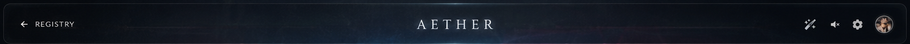

# Part 1: Fullscreen Console Layout & HUD Header

This fragment establishes the fullscreen fixed viewport console container (the "Galactic Operations Deck" shell), overlay background layers, and the top HUD navigation header bar. It ensures the interface breaks out of the standard reader viewport.

---

## 🎨 UI Architecture & References

### Concept Image Reference
Refer to the top bar layout and deep space background of the main concept card:


### Crop Reference (HUD Header)


---

## 🛸 Visual & Behavioral Specifications

1. **Standalone Viewport Container:**
   - Override standard margins, paddings, and page constraints when rendering the map stage.
   - The root container `.map-console-shell` must have:
     ```css
     position: fixed;
     inset: 0;
     z-index: 9999;
     width: 100vw;
     height: 100vh;
     overflow: hidden;
     background: #050811; /* Deep space dark backdrop */
     color: #e2e8f0;
     font-family: 'Inter', sans-serif;
     ```

2. **CRT holographic grid scanline overlay & Dark Vignette:**
   - Overlay a repeating linear-gradient or subtle pattern overlay simulating horizontal CRT scanning lines.
   - Overlay a dynamic radial-gradient vignette at the viewport edges (`rgba(0,0,0,0.8)` at edges, fading to transparent at center) to intensify the glow of celestial elements.

3. **Background Nebula & Particle Space:**
   - Integrate with the existing background particle system (`Particles.js` or canvas particles).
   - Render a custom backdrop with HSL tailored radial-gradient space nebulae:
     - Left-Center: `#003b5c` / `#002244` (faint cyan/blue gas clouds).
     - Right-Center: `#2a0845` / `#1b003a` (purple/magenta gas clouds).

4. **Floating HUD Header Bar:**
   - Sits pinned at the top center/stretch of the viewport.
   - Styled as a frosted glass container with a subtle bottom border and rounded bottom corners:
     - `backdrop-filter: blur(12px);`
     - `border: 1px solid rgba(0, 242, 254, 0.1);`
     - `background: rgba(10, 15, 30, 0.6);`
   - **Left Section:** A clean clickable back-link button labeled `← REGISTRY` in small caps, with a micro-hover transition (glowing cyan outline or color shift to `#00f2fe`).
   - **Center Section:** The platform brand title `A E T H E R` using thin modern typography with extra wide letter spacing (`letter-spacing: 0.4em;`).
   - **Right Section:** Icons for custom tools/settings matching the concept image:
     - Sparkles icon (Quick theme or particle toggler).
     - Mute/Volume icon (Audio feedback toggle).
     - Gear/Settings icon (Astrogation control toggles).
     - Circular user profile avatar frame with active status border.

---

## 🛠️ Step-by-Step Implementation Instructions

### Step 1.1: Setup Global CSS Foundations
Open [styles.css](file:///c:/Users/admis/OneDrive/Documents/GitHub/abstracto_tales/styles.css) and append the console container and header variables:
- Define layout styles for `.map-console-shell`.
- Define `.map-hud-bar` with flex row spacing, padding, and backdrop filter properties.
- Define scanline keyframes and vignette variables.
- Match HSL colors for the cyan theme (`#00f2fe`) and background nebulae.

### Step 1.2: Restructure the Stage Render Layout
In [js/render.js](file:///c:/Users/admis/OneDrive/Documents/GitHub/abstracto_tales/js/render.js#L538-L553), modify the outer shell layout inside `Render.maps()` to establish:
- Pinned `.map-console-shell` background wrapper.
- Pinned `.map-hud-bar` top bar with correct HTML nodes matching the left (`.map-hud-back`), center (`.map-hud-title`), and right (`.map-hud-actions` with custom icon triggers) columns.

### Step 1.3: Hook Setup & State Management
In [js/maps/MapViewer.js](file:///c:/Users/admis/OneDrive/Documents/GitHub/abstracto_tales/js/maps/MapViewer.js):
- Add state properties in `MapViewer.init()` to cache DOM elements of the console shell.
- Enforce full-page class changes on `document.body` (e.g. adding `.fullscreen-map-active`) to suppress site-wide navigation overflow and cover the primary navigation bar.
- Register click handlers for registry backlinks and system menu icon controls.

---

## 🔬 Manual Verification

1. **Fullscreen Layout:**
   - Launch index.html and navigate to a map `#maps/slug/mapId`.
   - Confirm the main website navbar is hidden and the map fills 100% of the screen.
   - Check that no vertical/horizontal scrollbars appear on the root body element.
2. **Backdrop Atmosphere:**
   - Confirm the dark vignettes and linear scanline CRT grid are overlaying correctly.
   - Verify space background gradients match the concept nebulae coloring.
3. **HUD Header Interaction:**
   - Check if clicking the `← REGISTRY` link navigates back to the map hub successfully.
   - Hover over the right-side icons and check if hover glows transition smoothly.
