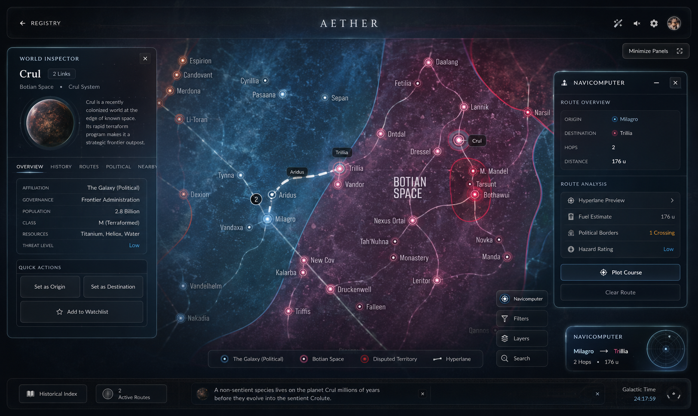
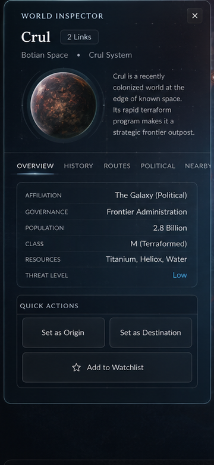

# Part 2: World Inspector (Left Dock Panel)

This fragment implements the left-docked **World Inspector** drawer. When a planet node is selected on the map, this panel slides out from the left, presenting celestial coordinates, orbital graphics, political telemetry, and navigation controls.

---

## 🎨 UI Architecture & References

### Concept Image Reference
Refer to the World Inspector dock panel on the left of the screen:


### Crop Reference (World Inspector)


---

## 🛸 Visual & Behavioral Specifications

1. **Panel Layout & Glassmorphism:**
   - Panel is positioned as a fixed overlay on the left margin:
     ```css
     position: absolute;
     top: 110px; /* Sits below top HUD header */
     left: 20px;
     bottom: 80px; /* Sits above footer */
     width: 360px;
     z-index: 500;
     display: flex;
     flex-direction: column;
     border-radius: 8px;
     border: 1px solid rgba(0, 242, 254, 0.15);
     background: rgba(10, 15, 30, 0.55);
     backdrop-filter: blur(20px) saturate(180%);
     box-shadow: 0 8px 32px 0 rgba(0, 0, 0, 0.37);
     transition: transform 0.4s cubic-bezier(0.16, 1, 0.3, 1), opacity 0.3s ease;
     ```
   - Sliding translation animation:
     - Open state: `transform: translateX(0); opacity: 1;`
     - Closed state: `transform: translateX(-380px); opacity: 0;`

2. **World Inspector Header:**
   - Header title `WORLD INSPECTOR` (small caps, font size ~0.75rem, spacing ~0.1em) with muted cyan color.
   - Pinned close icon (cross symbol) in the top-right corner to slide the panel away.
   - Active world title (large serif/sans-serif font, `#ffffff`) and inline "Link Count" badge:
     - e.g. `2 Links` inside a dark, bordered pill with small text.
   - Sector/System details below title: e.g. `Botian Space • Crul System` in muted text.

3. **3D Planetary Orb Widget:**
   - A circular preview frame hosting a spinning planetary sphere:
     - Styled as a `width: 90px; height: 90px; border-radius: 50%;` container.
     - Simulated depth using CSS multiple radial-gradients: a sphere shadow, an atmospheric glow ring (outer aura), and an inner-shadow gradient overlay.
     - Rotating animation simulating planetary rotation using repeating CSS background-position translation on a rocky texture background, or animated gradient masks.
   - Text block next to the orb displaying the database-sourced world description.

4. **Tabbed Information Navigation:**
   - Inline headers: `OVERVIEW`, `HISTORY`, `ROUTES`, `POLITICAL`, `NEARBY`.
   - Cyan indicator line (`2px` height, glowing shadow) positioned beneath the active tab.
   - **Overview Tab:** Key-value telemetry grid with thin border separators:
     - `AFFILIATION`: Faction name (e.g. `The Galaxy (Political)`).
     - `GOVERNANCE`: Administration level.
     - `POPULATION`: Count (e.g. `2.8 Billion`).
     - `CLASS`: Classification type (e.g. `M (Terraformed)`).
     - `RESOURCES`: Materials found.
     - `THREAT LEVEL`: Text with visual glow matching danger level (e.g. blue for Low, amber for Medium, red for High).
   - **Deterministic Hash Seeding:**
     - Since the database might not store governance, population, class, and resources details for every node, generate these values deterministically by hashing the world's name/ID string. This guarantees consistent specs across page reloads without database schema changes.

5. **Quick Actions Hub:**
   - Pinned at the bottom of the panel.
   - Two side-by-side buttons: `Set as Origin` and `Set as Destination` (thin-bordered glass button style).
   - A wide button below: `☆ Add to Watchlist` / `★ In Watchlist` synchronized to local storage.

---

## 🛠️ Step-by-Step Implementation Instructions

### Step 2.1: Implement Left Dock CSS
In [styles.css](file:///c:/Users/admis/OneDrive/Documents/GitHub/abstracto_tales/styles.css):
- Create the structural classes for `.dock-left` and its slide states.
- Author the planetary orb styles:
  ```css
  .planet-orb-container {
      width: 90px;
      height: 90px;
      border-radius: 50%;
      position: relative;
      box-shadow: 0 0 20px rgba(0, 242, 254, 0.2);
      overflow: hidden;
      background: radial-gradient(circle at 30% 30%, #5d4037, #1a0c00 70%);
  }
  .planet-orb-glow {
      position: absolute;
      inset: 0;
      border-radius: 50%;
      box-shadow: inset -10px -10px 20px rgba(0,0,0,0.8), inset 10px 10px 20px rgba(255,255,255,0.1);
      pointer-events: none;
  }
  ```
- Set up keyframe animation `.spinning` to shift background position of the planetary gradient.

### Step 2.2: Add World Inspector HTML structure
In [js/render.js](file:///c:/Users/admis/OneDrive/Documents/GitHub/abstracto_tales/js/render.js#L571-L587):
- Rebuild the `#world-intel-dock` markup.
- Define a template skeleton inside `Render.maps()` for rendering the World Inspector, including the planet orb element, tab rows, content container, and actions buttons.

### Step 2.3: Integrate Seed Hashing & Tab Rendering
In [js/maps/MapViewer.js](file:///c:/Users/admis/OneDrive/Documents/GitHub/abstracto_tales/js/maps/MapViewer.js):
- Create a deterministic hashing utility `getNodeSpecs(node)` to output consistent Affiliation, Governance, Population, Class, Resources, and Threat values.
- Add listeners for tab clicks (`OVERVIEW`, `HISTORY`, etc.) to dynamically swap content in the inspector.
- Hook "Set as Origin" and "Set as Destination" triggers to populate route endpoints in the navicomputer.
- Implement watchlist state checking and saving to `localStorage` (via node ID keys).

---

## 🔬 Manual Verification

1. **Inspector Slide-in:**
   - Click a planet node on the map.
   - Confirm the World Inspector slides smoothly from the left.
   - Click the "x" close button. Verify the panel slides out and hides.
2. **Rotating Planetary Orb:**
   - Confirm the 3D rotating planetary gradient orb displays correctly with shadows and atmospheric outer glow.
3. **Tab Navigation:**
   - Swap between `OVERVIEW` and other tabs. Confirm active underline indicator repositions.
   - Verify that data generated by `getNodeSpecs` is populated correctly and remains identical after refreshing the page.
4. **Quick Actions:**
   - Click "Add to Watchlist". Confirm text changes to "In Watchlist". Reload the page, click the same planet, and verify the watchlist state persists.
