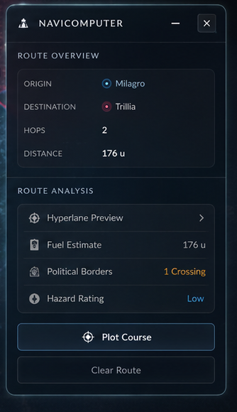

# Part 3: Navicomputer (Right Dock Panel) & Routing Logic

This fragment focuses on the right-docked **Navicomputer** panel. It handles coordinate input parameters, displays path distance telemetry, organizes collapsible accordions for flight statistics, and coordinates the Dijkstra pathfinding routing calculations.

---

## 🎨 UI Architecture & References

### Concept Image Reference
Refer to the Navicomputer dock panel on the right of the screen:


### Crop Reference (Navicomputer Panel)


---

## 🛸 Visual & Behavioral Specifications

1. **Panel Layout & Style:**
   - Sits on the right margin of the viewport:
     ```css
     position: absolute;
     top: 150px;
     right: 20px;
     bottom: 240px; /* Leaves space below for the bottom right status card */
     width: 334px;
     z-index: 500;
     display: flex;
     flex-direction: column;
     border-radius: 8px;
     border: 1px solid rgba(0, 242, 254, 0.15);
     background: rgba(10, 15, 30, 0.55);
     backdrop-filter: blur(20px) saturate(180%);
     box-shadow: 0 8px 32px 0 rgba(0, 0, 0, 0.37);
     transition: transform 0.4s cubic-bezier(0.16, 1, 0.3, 1), opacity 0.3s ease;
     ```
   - Sliding translation transitions:
     - Open: `transform: translateX(0); opacity: 1;`
     - Closed: `transform: translateX(360px); opacity: 0;`

2. **Navicomputer Header & Collapse:**
   - Displays icon `🛸` alongside `NAVICOMPUTER` in glowing cyan small caps.
   - Pinned control buttons: Collapse panel (minus icon) and Close panel (cross icon).

3. **Route Overview Metrics:**
   - Displays target path endpoints:
     - `ORIGIN`: Glowing blue bullet indicator + node name.
     - `DESTINATION`: Glowing red/pink bullet indicator + node name.
     - `HOPS`: Total count of intermediate system jumps.
     - `DISTANCE`: Numerical distance value (e.g. `176 u`).

4. **Collapsible Route Analysis Accordions:**
   - **Hyperlane Preview Accordion:**
     - Toggles revealing a chronological step-by-step list of hyperlane hop systems.
   - **Fuel Estimate Accordion:**
     - Displays estimated flight fuel requirements (calculated proportionally using distance: e.g. `1.0 gal/u` * distance units).
   - **Political Borders Accordion:**
     - Displays count of borders crossed between regional political zones (e.g., `1 Crossing` in amber/yellow warning text if crossing territory boundaries).
   - **Hazard Rating Accordion:**
     - Risk evaluation level:
       - `High` (red text) for route segments navigating off-lane (unregistered hyperlanes).
       - `Medium` (amber text) for routes crossing disputed zones or extremely long jumps.
       - `Low` (blue text) for standard on-lane mapped routes.

5. **Astrogation Plotting Buttons:**
   - **Plot Course Button:** Solid/glowing blue accent button styling with a navigation plotter icon. Executes the graph-based path calculations.
   - **Clear Route Button:** Muted dark button with thin border. Resets inputs, paths, status overlays, and calculations.

---

## 🛠️ Step-by-Step Implementation Instructions

### Step 3.1: Style right dock components
In [styles.css](file:///c:/Users/admis/OneDrive/Documents/GitHub/abstracto_tales/styles.css):
- Create classes for `.dock-right` and its open/closed transformation animations.
- Author accordion toggle styling:
  ```css
  .accordion-trigger {
      display: flex;
      justify-content: space-between;
      align-items: center;
      padding: 10px;
      cursor: pointer;
      border-bottom: 1px solid rgba(255,255,255,0.05);
  }
  .accordion-content {
      max-height: 0;
      overflow: hidden;
      transition: max-height 0.3s ease-out;
  }
  .accordion-content.expanded {
      max-height: 200px;
      overflow-y: auto;
  }
  ```
- Design the `.plot-course-btn` glow states.

### Step 3.2: Rebuild Navicomputer panel structure
In [js/render.js](file:///c:/Users/admis/OneDrive/Documents/GitHub/abstracto_tales/js/render.js#L588-L650):
- Restructure the Navicomputer sidebar section.
- Create input containers, datalists for auto-suggestions, route metrics widgets, accordion triggers, and final control buttons.

### Step 3.3: Dynamic Dijkstra pathfinding integration
In [js/maps/MapViewer.js](file:///c:/Users/admis/OneDrive/Documents/GitHub/abstracto_tales/js/maps/MapViewer.js):
- Connect the auto-suggestion datasets (`planet-datalist`) using loaded node values.
- Wire event listeners to the origin/destination inputs, automatically updating routing parameters.
- Re-bind the Dijkstra graph search algorithm to calculate hop chains when the Plot Course button is clicked.
- Implement formulas for border crossings (compare regional properties on nodes), fuel math, and hazard warnings (check edge properties or off-lane snaps).
- Trigger canvas/SVG overlays to trace path lines across mapped systems.

---

## 🔬 Manual Verification

1. **Panel Open / Slide Behavior:**
   - Click the Navicomputer trigger in the HUD controls. Confirm panel slides in from the right.
   - Click the collapse/minimize icon in the header. Check if panel slides away.
2. **Auto-Suggestion Check:**
   - Type in the Origin input box. Confirm system names matching the search query populate in a dropdown.
3. **Plotted Trajectory:**
   - Select Origin (e.g. `Milagro`) and Destination (e.g. `Trillia`). Click **Plot Course**.
   - Check if path SVG lines are drawn on the map canvas.
   - Verify that hops and distance metrics match the route overview values.
4. **Accordions & Flight Specs:**
   - Click the collapsible accordions. Check if details expand smoothly.
   - Confirm fuel estimates, political crossings, and hazard ratings calculate correctly.
5. **Reset Check:**
   - Click **Clear Route**. Confirm paths are erased from the map and navicomputer values return to default.
