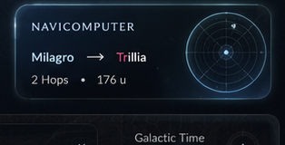
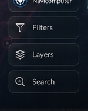
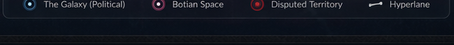
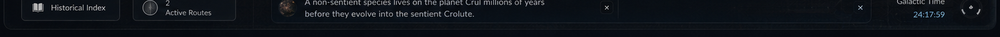

# Part 4: HUD Overlays, Legend, & Footer Ticker Bar

This fragment implements the overlay interactive controls, legend panel, bottom footer ticker, minimize triggers, and the CSS conic-gradient radar sweep widget.

---

## 🎨 UI Architecture & References

### Concept Image Reference
Refer to the HUD stack, legend, footer, and radar sweep in the concept layout:


### Crop Reference (Navicomputer Status Card)


### Crop Reference (HUD Stack Buttons)


### Crop Reference (Legend)


### Crop Reference (Footer)


---

## 🛸 Visual & Behavioral Specifications

1. **Bottom Right Status Card & Radar Sweep Widget:**
   - Card is fixed in the bottom-right corner (`bottom: 90px; right: 20px; width: 314px; height: 160px;`).
   - Sits beneath the right-dock panel. Styled in a glassmorphic container matching the other panels.
   - Displays heading `NAVICOMPUTER` in small caps, followed by the active route path:
     - e.g., `Milagro → Trillia` with Hop count and Distance details.
     - Displays `Navicomputer Online` if no course is active.
   - **Vector Radar Sweep Widget:**
     - A circular radar scope (`width: 80px; height: 80px;`) on the right side of the card.
     - Crafted using pure CSS/SVG: includes dashed concentric circles, crosshairs, and a sweeping radial arm.
     - Uses CSS `conic-gradient` sweep animation rotating infinitely (`transform: rotate(360deg)`).
     - Renders small blinking nodes (blips) that light up when the radar sweep passes over their coordinates.

2. **HUD Pill Buttons Stack:**
   - A floating vertical pill button stack positioned on the bottom right (`right: 360px; bottom: 90px;`).
   - Individual rounded pill buttons:
     - `Navicomputer` (toggles the right dock).
     - `Filters` (reveals map filters overlay).
     - `Layers` (toggles planet labels and hyperlane line visibility).
     - `Search` (focuses map search input box).
   - Glassmorphic look with frosted backdrop and micro-hover color changes.

3. **Bottom Center Legend Panel:**
   - A floating horizontal legend pinned above the footer (`bottom: 90px; left: 50%; transform: translateX(-50%);`).
   - Identifies faction territory markers:
     - `The Galaxy (Political)` (cyan ringed circle marker).
     - `Botian Space` (magenta ringed circle marker).
     - `Disputed Territory` (red ringed circle marker).
     - `Hyperlane` (a dashed gray line symbol).

4. **Bottom Footer Ticker Bar:**
   - A fixed full-width footer strip spanning the bottom of the viewport (`height: 60px; bottom: 0;`).
   - **Left:**
     - Clickable `Historical Index` button (with open-book icon, opens history index).
     - `Active Routes` badge indicating number of plotted courses (with vertical signal pulse waves).
   - **Center:**
     - Scrolling terminal marquee ticker: "Contribute Ticker" displays stories updates, lore quotes, and invites reader map contributions. Has a close 'x' icon.
   - **Right:**
     - `Galactic Time` digital clock displaying ticking system time (`HH:MM:SS` format).
     - Spinning astrogation dashboard gear widget next to the clock.

5. **Minimize Panels Toggle:**
   - Pinned at the top right of the viewport, below the HUD header.
   - A clean button: `Minimize Panels` with a expand/collapse icon.
   - On click, collapses all overlay elements (left/right docks, status card, legend, footer) off-screen using translation transition classes (`transform: translateY(150%)` or `translateX(150%)`).
   - Replaces text with a compact icon to `Expand Panels` and restore visible widgets.

---

## 🛠️ Step-by-Step Implementation Instructions

### Step 4.1: Code CSS Radar, Ticker, and Transitions
In [styles.css](file:///c:/Users/admis/OneDrive/Documents/GitHub/abstracto_tales/styles.css):
- Create the conic gradient radar rotation styles:
  ```css
  .radar-scope {
      width: 80px;
      height: 80px;
      border-radius: 50%;
      border: 1px solid rgba(0, 242, 254, 0.3);
      background: radial-gradient(circle, transparent 40%, rgba(0,0,0,0.4)), conic-gradient(from 0deg, rgba(0, 242, 254, 0.4), transparent 50%);
      animation: radar-sweep 4s linear infinite;
  }
  @keyframes radar-sweep {
      from { transform: rotate(0deg); }
      to { transform: rotate(360deg); }
  }
  ```
- Define scrolling news ticker marquee animations.
- Set up transition classes `.panel-minimized` to slide docks out of screen limits.

### Step 4.2: Build footer and HUD overlays HTML
In [js/render.js](file:///c:/Users/admis/OneDrive/Documents/GitHub/abstracto_tales/js/render.js#L652-L693):
- Rebuild the bottom overlays inside `Render.maps()`.
- Add containers for `.map-controls`, `.cartographer-beacon`, and bottom status widgets.

### Step 4.3: Implement Ticker interval, Minimizer, and Clock sync
In [js/maps/MapViewer.js](file:///c:/Users/admis/OneDrive/Documents/GitHub/abstracto_tales/js/maps/MapViewer.js):
- Add a periodic `setInterval` inside `MapViewer.init()` to update the Galactic Clock to match the current local system time.
- Implement click listeners on the `Minimize Panels` button that toggle `.panel-minimized` class modifiers across all UI overlays.
- Wire the HUD stack buttons to show/hide docks and zoom states.
- Sync active course calculations to update status card values (`Milagro → Trillia`).

---

## 🔬 Manual Verification

1. **Minimize Panels Toggling:**
   - Click the **Minimize Panels** button. Confirm left/right docks, status card, legend, and footer slide off-screen smoothly.
   - Click the toggle again (which should now say Expand). Verify all elements return.
2. **Radar Sweep Animation:**
   - Verify the circular radar sweep on the status card spins smoothly and features concentric ring layers.
3. **Galactic Clock:**
   - Confirm the clock ticking value updates every second and accurately matches system time. Check that the astrogation gear spins next to it.
4. **Scrolling Marquee:**
   - Ensure the news ticker text flows smoothly from right to left across the center container.
5. **HUD Controls Stack:**
   - Test each button in the HUD stack: click Layers to confirm labels/hyperlanes vanish, test Search to verify the input gets focus.
